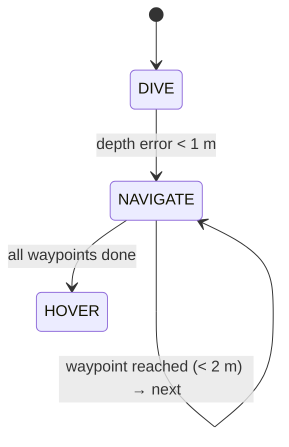

<div align="center">

# 🌊 Autonomous UUV — ROS / Gazebo


**🇬🇧 English** · [🇹🇷 Türkçe](#-türkçe)

</div>

## 🇬🇧 Overview

An autonomous mission controller for an underwater vehicle (RexROV) running in the **UUV Simulator / Gazebo** environment. The vehicle dives to a target depth, follows a set of waypoints, avoids obstacles with sonar and holds its position when the mission is complete.

### Mission state machine

A `SURFACE` behaviour (controlled ascent) is also implemented for end-of-mission use.

### Features
- 🎯 **PD depth control**: depth estimated from the **pressure sensor** (hydrostatic equation)
- 🧭 **Waypoint navigation**: heading control from IMU yaw, position from ground-truth odometry
- 🚧 **Obstacle avoidance**: 4 sonar beams (front/right/back/left), slows down below 5 m and evades below 3 m
- 🛟 **Safety limits**: velocity saturation and a minimum altitude above the seabed from the **DVL**
- 🛑 **Hover mode**: cancels drift using DVL velocity feedback
- 🧱 Custom Gazebo models: target shapes (triangle, pentagon, hexagon, star, cylinder) and a path model

### Architecture
```
 pressure ─┐                                 ┌─► cmd_vel ─► cascaded PID (velocity → accel)
 IMU ──────┤                                 │            ─► thruster manager ─► RexROV
 DVL ──────┼─► gazebo_autonomous_controller ─┘
 sonar x4 ─┤      (10 Hz state machine)
 pose_gt ──┘
```

### Run
Requires ROS Melodic + [UUV Simulator](https://github.com/uuvsimulator/uuv_simulator) in your catkin workspace.
```bash
cd catkin_ws && catkin build && source devel/setup.bash
roslaunch uuv_gazebo_worlds empty_underwater_world.launch
roslaunch uuv_descriptions upload_rexrov.launch mode:=default x:=0 y:=0 z:=-20 namespace:=rexrov
roslaunch autonomous_uuv autonomous_rexrov.launch
```
`baslat.sh` starts the world, the vehicle and keyboard teleoperation for manual testing.

| Path | Contents |
|---|---|
| `catkin_ws/src/autonomous_uuv/` | ROS package: controller node + launch file |
| `sekiller/`, `yol/` | Custom Gazebo models (target shapes, path) |
| `baslat.sh` | Manual-control quick start script |

---

## 🇹🇷 Türkçe

**UUV Simulator / Gazebo** ortamında çalışan su altı aracı (RexROV) için otonom görev kontrolcüsü. Araç hedef derinliğe dalar, waypoint'leri sırayla takip eder, sonar ile engellerden kaçınır ve görev bitince konumunu korur.

### Özellikler
- 🎯 **PD derinlik kontrolü**: derinlik, **basınç sensöründen** hidrostatik denklemle hesaplanır
- 🧭 **Waypoint navigasyonu**: IMU'dan alınan yaw ile yön kontrolü, odometriden konum bilgisi
- 🚧 **Engelden kaçınma**: 4 sonar (ön/sağ/arka/sol); 5 m altında yavaşlar, 3 m altında kaçış manevrası yapar
- 🛟 **Güvenlik sınırları**: hız sınırlama ve **DVL** ile deniz tabanına minimum yükseklik koruması
- 🛑 **Hover modu**: DVL hız geri beslemesiyle sürüklenmeyi sıfırlar
- 🧱 Özel Gazebo modelleri: hedef şekiller (üçgen, beşgen, altıgen, yıldız, silindir) ve yol modeli

### Çalıştırma
ROS Melodic ve catkin çalışma alanında [UUV Simulator](https://github.com/uuvsimulator/uuv_simulator) kurulu olmalıdır. Komutlar için yukarıdaki **Run** bölümüne bakın.
